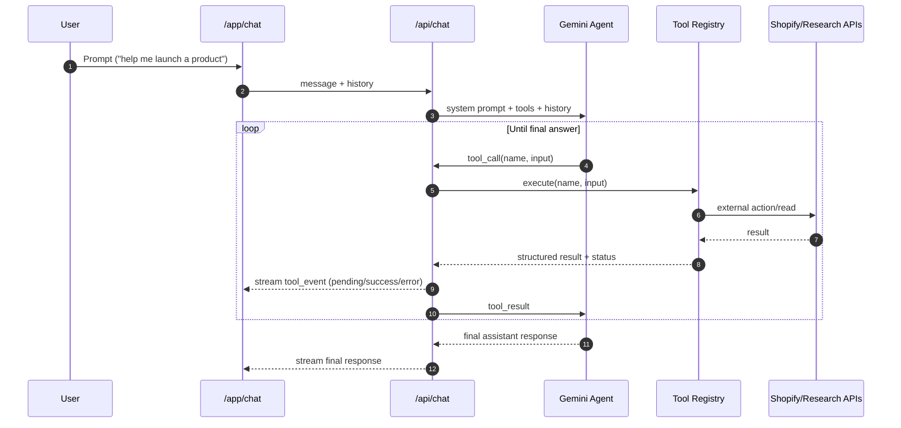
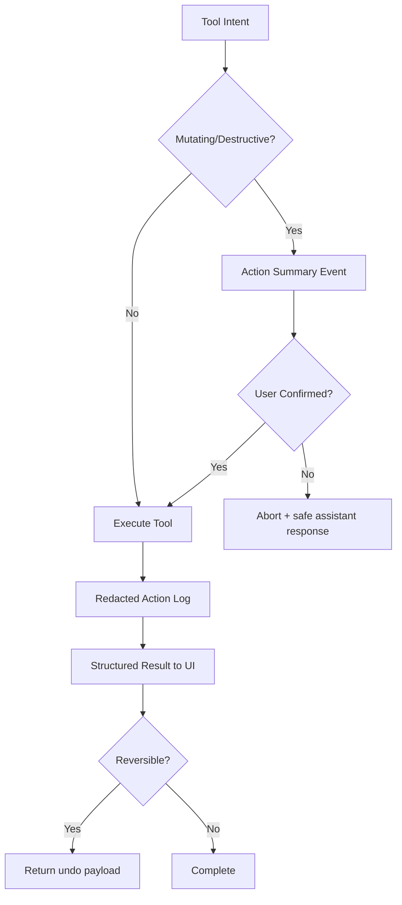
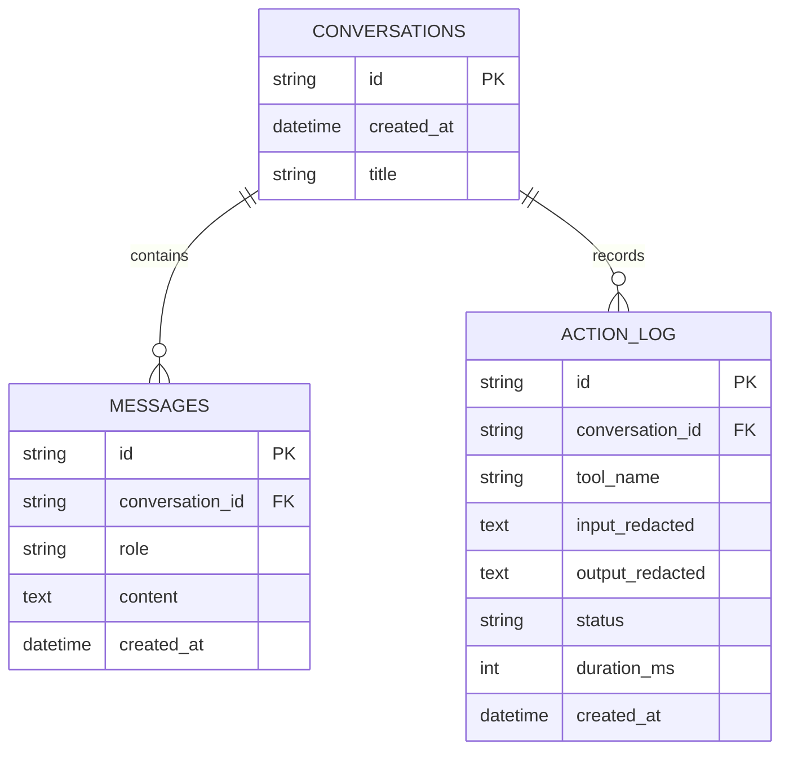

# Orpheus Showcase Diagrams

these are presentation-ready mermaid diagrams you can paste into Notion, GitHub, or Mermaid Live.

## 1) System Architecture

```mermaid
flowchart LR
  U[Store Owner]
  UI[Next.js Chat UI\n/app/chat]
  API[/api/chat]
  AGENT[Gemini Agent Loop\nintent + tool orchestration]
  REG[Tool Registry]

  SHOP[Shopify Admin API]
  RS[Research Sources\n(Firecrawl/Web)]
  IMG[Image Generation]

  DB[(SQLite + Drizzle\nconversations/messages/action_log)]
  SAFE[Safety Layer\nconfirmations/redaction/undo]

  U --> UI --> API --> AGENT --> REG
  REG --> SHOP
  REG --> RS
  REG --> IMG

  API --> DB
  API --> SAFE
  SAFE --> REG
```

## 2) Core Agent Execution Loop



## 3) Zero-to-Store Hero Flow

```mermaid
flowchart TD
  A[User: "I want to sell minimalist desk lamps"] --> B[research_market]
  B --> C[research_competitors]
  C --> D[generate_product_listing]
  D --> E[shopify_create_product]
  E --> F[Optional: shopify_discounts_collections]
  F --> G[Assistant summary + next actions]
```

## 4) Safety & Trust Controls



## 5) Data Model (MVP)



## 6) Showcase Readiness Snapshot


