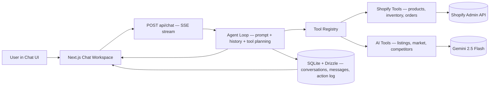

<div align="center">

  # Orpheus

  **Tell Orpheus what you want to sell, and it builds your store, researches your market, creates your listings, and launches your marketing — all from a single chat window.**

  [](https://nextjs.org/)
  [](https://www.typescriptlang.org/)
  [](https://ai.google.dev/)
  [](https://opensource.org/licenses/MIT)

  [Report Bug](https://github.com/shamsharoon/Shams-E/issues) · [Request Feature](https://github.com/shamsharoon/Shams-E/issues)
</div>

<div align="center" style="margin: 40px 0;">
  
  <p><em>Orpheus — AI-powered e-commerce from a single chat window</em></p>
</div>

---

## 🎯 Overview

Orpheus is an **AI-first e-commerce copilot** — Cursor for Shopify. Describe what you want in plain English, and the agent builds it: products, listings, mockups, marketing campaigns, inventory updates, and more.

> *"Create a hoodie with a sunset design, put it on Shopify at $29.99 with 10 in stock, and draft an Instagram campaign"* — Done.

### ✨ Why Orpheus?

- **Conversational Store Management** — Manage your entire Shopify store through chat
- **End-to-End Automation** — From image generation to product listing to marketing copy in one conversation
- **12-Tool Agent** — Gemini 2.5 Flash with function-calling chains tools automatically
- **Live Dashboard** — Real-time store metrics alongside the AI chat
- **Web-Based** — No installation required beyond `npm install`

---

## 🚀 Features

### 🤖 AI-Powered Tools

| Feature | Description |
|---------|-------------|
| **Natural Language Store Management** | "List my products" / "Update the hoodie price to $35" — AI executes Shopify operations |
| **AI Image Generation** | Generate product artwork, logos, and designs from text descriptions |
| **Printify Mockups** | Place artwork onto physical products (t-shirts, hoodies, mugs) with lifestyle model shots |
| **Marketing Campaigns** | Generate Instagram captions, email copy, and ad text with mockup photos |
| **Market Research** | Analyze trends, pricing bands, and competitor positioning for any niche |
| **Product Listing Generation** | AI-written titles, descriptions, tags, SEO metadata, and pricing suggestions |

### 🏪 Store Management

- **Product CRUD** — Create, update, list, and search Shopify products through chat
- **Inventory & Orders** — Monitor stock levels, view orders, manage fulfillment
- **Discounts & Collections** — Create discount codes and organize product collections
- **Store Analytics** — Health score, revenue tracking, conversion rates, and AI-generated insights
- **Confirmation Flow** — Destructive actions require explicit user approval before executing

### 🎨 Dashboard & UI

- **Split Layout** — Live store dashboard (left) + AI chat sidebar (right)
- **SSE Streaming** — Real-time token streaming with tool activity pills
- **Image Lightbox** — Click to zoom on generated images and mockups
- **Voice Input** — Speak your commands instead of typing
- **Mock Mode** — Full flow with seeded data when Shopify credentials aren't available

---

## 🏗️ Architecture



### How it works

1. User sends a message in the chat workspace
2. Frontend POSTs conversation state to `/api/chat`
3. Agent loop (Gemini 2.5 Flash with function-calling) plans and executes tool calls through a typed registry
4. Each tool result is normalized, logged, and streamed back via SSE (`token`, `tool_call`, `tool_result`, `done`)
5. Frontend renders streamed text, tool activity pills, and refreshes the dashboard on write operations
6. Persistence stores chat history and action logs in SQLite via Drizzle

### Trust & safety controls

- Confirmation step for destructive/bulk actions
- Transparent pre-action summaries
- Redacted secrets in logs
- Mock mode fallback for reliability

---

## 🛠️ Tech Stack

<div align="center">

### Frontend


### AI & APIs


### Backend & Services


</div>

---

## 🏃 Quick Start

### Prerequisites

- Node.js 18+
- npm

### Installation

```bash
# Clone the repository
git clone https://github.com/shamsharoon/Shams-E.git
cd Shams-E

# Install dependencies
npm install

# Copy environment variables
cp .env.example .env
```

### Environment Variables

Create a `.env` file:

```bash
# AI
GEMINI_API_KEY=your_gemini_api_key

# Supabase Auth
SUPABASE_URL=your_supabase_url
SUPABASE_ANON_KEY=your_supabase_anon_key
NEXT_PUBLIC_SUPABASE_URL=your_supabase_url
NEXT_PUBLIC_SUPABASE_ANON_KEY=your_supabase_anon_key

# Shopify (optional — set MOCK_MODE=true to skip)
SHOPIFY_STORE_URL=your_store.myshopify.com
SHOPIFY_ACCESS_TOKEN=your_access_token

# Printify (optional)
PRINTIFY_API_TOKEN=your_printify_token
PRINTIFY_SHOP_ID=your_shop_id

# Mock mode — run with seeded data, no credentials needed
MOCK_MODE=true
```

### Run Development Server

```bash
npm run dev
```

Open [http://localhost:3000](http://localhost:3000)

---

## 🎯 Usage Examples

### Natural Language Commands

```
User: "list my products"
Orpheus: ✓ Found 12 products — here's a summary...

User: "create a hoodie with a sunset design at $29.99"
Orpheus: ✓ Generated artwork → Created mockups → Listed on Shopify

User: "run an instagram campaign for the flag hoodie"
Orpheus: ✓ Found product → Generated lifestyle mockups → Drafted caption with hashtags
```

### Tool Chaining

```
User: "design a logo, put it on a mug, and add it to my store for $15"
  → generate_product_image (create artwork)
  → printify_generate_mockups (place on mug)
  → shopify_create_product (list at $15)
  → Done — 3 tools chained automatically
```

---

## 📁 Project Structure

```
src/
├── app/
│   ├── page.tsx                  # Landing page (WebGL shader hero + Spline 3D)
│   ├── auth/page.tsx             # Authentication (sign in / sign up / magic link)
│   ├── chat/page.tsx             # Dashboard + AI chat sidebar
│   ├── api/chat/route.ts         # SSE streaming chat endpoint (Gemini agent loop)
│   └── api/dashboard/route.ts    # Dashboard data endpoint
├── components/
│   ├── chat/
│   │   ├── dashboard-panel.tsx   # Store dashboard with metrics, products, orders
│   │   └── chat-sidebar.tsx      # AI chat with SSE streaming + tool activity
│   └── ui/
│       ├── orpheus-logo.tsx      # Brand logo SVG component
│       ├── shader-animation.tsx  # WebGL ring shader
│       └── spotlight.tsx         # SVG spotlight effect
├── lib/
│   ├── ai/
│   │   ├── gemini-agent.ts       # Gemini function-calling orchestrator + fallback
│   │   └── tool-schemas.ts       # JSON Schema definitions for all 12 tools
│   ├── tools/
│   │   ├── registry.ts           # Tool registry and execution engine
│   │   └── ...                   # Individual tool implementations
│   ├── db/                       # Conversation and action log persistence
│   ├── printify/                 # Printify API client
│   ├── security/                 # Input redaction utilities
│   └── supabase/                 # Supabase client configuration
└── public/                       # Static assets
```

---

## 🐛 Known Issues

- In-memory image store is lost on server restart (no persistent image storage yet)
- File-based conversation persistence won't scale (SQLite migration in progress)
- Dashboard API caps at 50 products and 20 orders (no pagination yet)

---

## 🤝 Contributing

Contributions are welcome! Please feel free to submit a Pull Request.

1. Fork the project
2. Create your feature branch (`git checkout -b feature/AmazingFeature`)
3. Commit your changes (`git commit -m 'Add some AmazingFeature'`)
4. Push to the branch (`git push origin feature/AmazingFeature`)
5. Open a Pull Request

---

## 📝 License

This project is licensed under the MIT License - see the [LICENSE](LICENSE) file for details.

---

## 📧 Contact

**Team:**
- Ali Shamsi
- Julian Cruzet
- Shams Haroon

Project Link: [https://github.com/shamsharoon/Shams-E](https://github.com/shamsharoon/Shams-E)

---

<div align="center">
  <sub>Built with ❤️ for merchants who move fast</sub>
</div>
